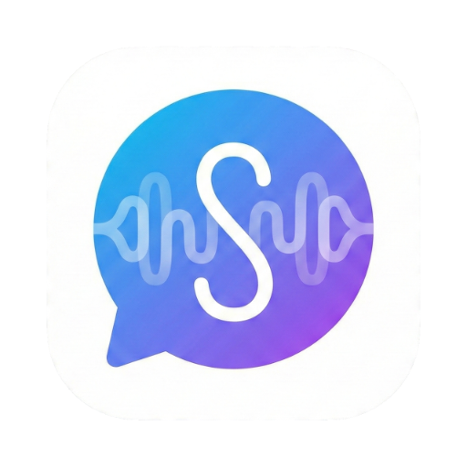
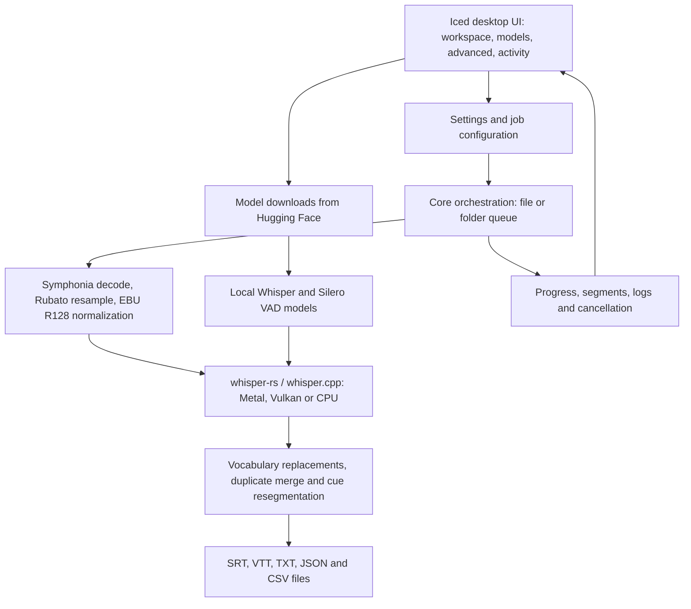

<p align="center"></p>

# Subtly

Subtly is AER's desktop app for turning local video and audio into subtitles with Whisper. Pick a file or folder, choose a model, and generate readable cues on your own computer. The Rust application uses Iced for its interface, Metal on macOS and Vulkan on Windows/Linux for inference, with CPU fallback when GPU inference cannot run.

[Product website](https://subtly.aer.app) · [Downloads](https://github.com/Team-AER/Subtly/releases) · [Report an issue](https://github.com/Team-AER/Subtly/issues)

The product page demonstrates the waveform-to-subtitle workflow, cue cleanup, GPU backends and model choices. Its animated examples are demonstrations; the website lives in [aer-landing/subtly](https://github.com/Team-AER/aer-landing/tree/main/subtly), separately from this desktop application.

## Features

- **File and folder input:** process a single media file or recursively batch a folder. Decoding runs in-process; no external FFmpeg installation is used.
- **Five export formats:** SRT, VTT, TXT, JSON and CSV from the same transcription pass; output defaults to beside the input.
- **Readable cues:** word-aligned resegmentation with character and duration limits, plus duplicate merging.
- **Vocabulary tools:** an initial prompt for names and jargon, and find/replace rules with case-sensitive and whole-word options.
- **Language controls:** automatic detection with the detected language shown in the workspace, explicit language selection, and optional translation to English. Translation is off by default.
- **Local models:** download, select and remove Whisper models in Models; Silero VAD identifies speech regions.
- **Visible progress:** cancellation, per-file batch progress, hardware status and an activity log. Advanced exposes decoding, VAD and subtitle settings.

Transcription runs locally once the required models are installed. First-time model downloads require network access to Hugging Face; building also downloads Rust dependencies and the bundled VAD asset. Optional update checks and crash reporting can use the network when enabled. Local inference alone is not a guarantee of an air-gapped installation.

## Get started

Download the appropriate installer from [GitHub Releases](https://github.com/Team-AER/Subtly/releases). The current build workflow packages Apple Silicon macOS, Windows x64 and Linux x64. Intel macOS is present in the cargo-dist target configuration but is not built by the current packaging matrix; Windows ARM64 is not configured.

1. Open **Models** and download a Whisper model. `large-v2` is the default accuracy-first choice (about 3.1 GB); `tiny` is about 78 MB for a quick trial. Check the VAD status too and download it if missing.
2. In the workspace, choose **Pick file** or **Pick folder**. Leave Output blank to write beside the input, or choose a destination.
3. Select export formats and optionally supply vocabulary and replacement rules. Adjust language or translation under Advanced if needed.
4. Choose **Generate subtitles**. Inspect progress or the activity log, and review the generated text before publishing.

Folder discovery recognizes MP4, MKV, MOV, WAV, MP3, M4A, FLAC and OGG extensions. Actual decoding depends on the file's container and codec support in Symphonia; an extension does not guarantee the audio will decode.

## Architecture



The current v2 application links whisper.cpp directly through `whisper-rs`. Audio processing and inference run in-process on blocking worker threads, with events sent back to the UI and a watch channel for cancellation. Earlier Electron/sidecar plans are historical; [initial-vision.md](initial-vision.md) is not the current build guide.

## Build from source

Use current stable Rust (the toolchain used by CI), a C/C++ toolchain and CMake. The workspace does not declare a tested minimum Rust version.

| Platform | Native prerequisites |
|---|---|
| macOS | Xcode command-line tools / Metal SDK, CMake and pkg-config |
| Windows x64 | MSVC C++ tools, CMake, Ninja and the Vulkan SDK; CI pins CMake 3.30.8 |
| Linux x64 | C/C++ tools, CMake, pkg-config, Vulkan headers/loader and desktop libraries; see the complete apt list in [build.yml](.github/workflows/build.yml) |

The macOS packager declares a 10.15 minimum, while CI builds on macOS 14. The Linux CI runner is Ubuntu 22.04; older distribution compatibility is not verified here. Debian packaging declares `libvulkan1` and `libgl1`. Windows packaging stages Visual C++ runtime DLLs alongside the executable; local Windows packaging must stage those as CI does.

```sh
git clone https://github.com/Team-AER/Subtly.git
cd Subtly

# Download the SHA256-checked VAD asset, then mirror it into the dev asset path.
cargo run -p xtask -- download-assets
cargo run -p xtask -- sync-assets

cargo run -p subtly-ui
```

Both asset steps matter: the runtime resolver checks `runtime/assets` before `resources/runtime-assets` during development. A downloaded VAD file only in the latter can be hidden by the existing staging directory.

```sh
# Core diagnostics (these do not transcribe audio)
cargo run -p subtly-core --bin subtly-cli -- ping
cargo run -p subtly-core --bin subtly-cli -- list-devices
cargo run -p subtly-core --bin subtly-cli -- smoke

# Preview planned output paths without inference or model validation
cargo run -p subtly-core --bin subtly-cli -- transcribe /path/to/file.mp4 --dry-run

# Actual CLI inference: supply a downloaded Whisper model explicitly
cargo run -p subtly-core --bin subtly-cli -- transcribe /path/to/file.wav \
  --model /path/to/ggml-large-v2.bin \
  --vad runtime/assets/models/silero_vad.bin

cargo test --workspace
cargo build --release -p subtly-ui
```

Run `target/release/subtly` on macOS/Linux or `target\release\subtly.exe` on Windows. Model files are separate from the executable. If a codec fails to decode, convert the audio to a supported format using your own media tools before retrying.

## Settings and models

Paths come from `directories::ProjectDirs::from("app", "aer", "Subtly")`, not a single shared path across operating systems:

| OS | Settings | Downloaded models |
|---|---|---|
| macOS | `~/Library/Application Support/app.aer.Subtly/settings.json` | `~/Library/Application Support/app.aer.Subtly/models/` |
| Linux | `$XDG_CONFIG_HOME/subtly/settings.json` (default `~/.config/subtly/settings.json`) | `$XDG_DATA_HOME/subtly/models/` (default `~/.local/share/subtly/models/`) |
| Windows | `%APPDATA%\aer\Subtly\config\settings.json` | `%APPDATA%\aer\Subtly\data\models\` |

`AER_ASSET_DIR` overrides the bundled asset directory; it should contain `models/silero_vad.bin`. `RUST_LOG` controls tracing verbosity. Settings persist the chosen model, output formats, vocabulary, language, VAD and cue options. The model catalog is in [models.rs](crates/subtly-core/src/models.rs): large-v2, large-v3, large-v3-turbo, large-v3-turbo-q5_0, medium, small, base and tiny. Model downloads are checked against expected size; the build-time bundled VAD download additionally has a manifest SHA256 check.

## Packaging and signing

```sh
cargo install cargo-packager --locked
cargo run -p xtask -- download-assets
cargo build --release -p subtly-ui
cargo packager --release
```

Packages are written under `release/`. Choose host formats with `--formats app` on macOS, `--formats nsis` on Windows, or `--formats deb` / `--formats appimage` on Linux. Build on the relevant OS. The [build workflow](.github/workflows/build.yml) stages platform assets and creates artifacts; artifact creation does not by itself establish signing or notarization.

For macOS distribution follow [code-signing.md](docs/code-signing.md). The workflow signs and notarizes the app before constructing its DMG so it does not replace the signed app with a fresh unsigned bundle.

| Optional UI feature | Current behavior |
|---|---|
| `crash-reporting` | Enables Sentry initialization when `SENTRY_DSN` is set |
| `auto-update` | Enables axoupdater; requires an installation receipt and currently targets `prakhar1989/Subtly` |

Both features are disabled by default. cargo-dist metadata exists, but the checked-in Build workflow uses cargo-packager; do not assume the optional updater is configured for Team-AER releases.

## Repository guide and credits

| Path | Purpose |
|---|---|
| `crates/subtly-core/` | Model catalog, downloads, settings, audio, inference and exports |
| `crates/subtly-ui/` | Desktop interface and optional updater/crash reporting |
| `crates/xtask/` | Asset download/sync, packaging and notarization helpers |
| `resources/` | Existing Subtly icon, entitlements, installer support and packaged VAD staging |
| `runtime/assets/` | Development asset staging |
| `docs/` | Maintainer signing and certificate guides |

Subtly v2 continues the earlier Subtly application, replacing its Electron and external-tool pipeline with Rust. Its accuracy-first default acknowledges Aiko's model-selection approach; Subtly is a separate application. Thanks to OpenAI Whisper, whisper.cpp, whisper-rs, Iced, Symphonia, Rubato, EBU R128 and Silero VAD and their contributors. The project is [MIT licensed](LICENSE); dependency and model licenses remain their own.
